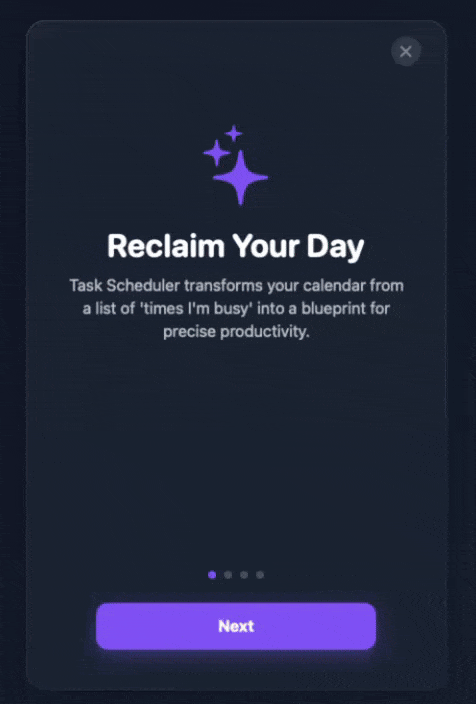
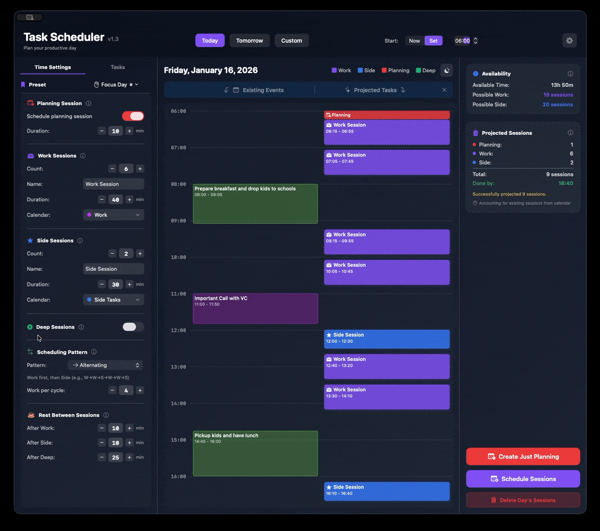
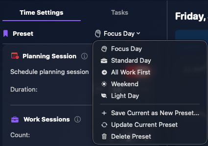

<div align="center">

# Task Scheduler

**Smart scheduling for productive days**

[](LICENSE)
[](https://www.apple.com/macos)
[](https://swift.org)
[](https://github.com/kibermaks/TaskScheduler/actions)
[](https://github.com/kibermaks/TaskScheduler/releases/latest)

Task Scheduler is a native macOS application built with SwiftUI that helps you plan productive days by automatically scheduling work and side sessions around existing calendar events. It features a powerful scheduling engine, preset management, and a beautiful timeline visualization.

[Download Latest Release](https://github.com/kibermaks/TaskScheduler/releases/latest) • [Documentation](#-documentation) • [Contributing](CONTRIBUTING.md)

</div>

---

## ✨ Key Features

- **🧠 Smart Scheduling**: Automatically fits work, side and deep sessions into available gaps in your macOS Calendar
- **🔄 Dynamic Patterns**: Choose from multiple scheduling patterns (Alternating, All Work First, All Side First, Custom Ratio)
- **💾 Preset Management**: Save and quickly apply different configurations for Workdays, Focus Days, or Weekends
- **📊 Timeline Visualization**: Interactive side-by-side view of existing calendar events and projected sessions
- **📅 Calendar Integration**: Read from and write directly to macOS Calendar calendars
- **⚙️ Customizable Sessions**: Configure names, durations, and target calendars for different session types (Work, Side, Planning, Deep Work)
- **🎯 Hashtag System**: Track existing sessions with hashtags (#work, #side, #deep, #plan)
- **🌙 Beautiful UI**: Dark-themed glassmorphic design with intuitive controls

## 🛡 Gatekeeper & First Launch

Task Scheduler ships outside the Mac App Store, so Gatekeeper may warn you the first time you open it. Use **System Settings → Privacy & Security → Open Anyway** (or right-click the app in Finder and choose **Open**) to continue; power users can also drop the quarantine flag below.

<p align="center">
  
</p>

<p align="center">
  
</p>

```bash
xattr -d com.apple.quarantine /Applications/Task\ Scheduler.app
```

## 🖼 Visual Walkthrough

### Welcome Guide

<p align="center">
  
</p>

### Command Center

Timeline, projections, and controls share a single glass panel so you can see inputs and outputs together.

<p align="center">
  
</p>

### Dynamic Scheduling

Sessions flow around existing events instantly as you tweak durations or presets.

<p align="center">
  
</p>

### Preset Library

Workday, Focus, Weekend, or any custom preset stays one click away.

<p align="center">
  
</p>

### Availability Insights

Summary cards highlight real events, projected work, and when you are supposed to be free.

<p align="center">
  
</p>

## 🚀 Installation

### Option 1: Download Pre-built Release (Recommended)

1. Download the latest `TaskScheduler-vX.X.dmg` from [Releases](https://github.com/kibermaks/TaskScheduler/releases/latest)
2. Open the DMG file
3. Drag `TaskScheduler.app` to your Applications folder
4. Launch from Applications or Spotlight
5. Grant Calendar permissions when prompted

### Option 2: Build from Source

See [Building from Source](#-building-from-source) section below.

> **Heads-up:** macOS may warn about unidentified developers the first time you open the app. Follow the steps in [Gatekeeper & First Launch](#-gatekeeper--first-launch) if that happens.

## 🎯 Quick Start

1. Launch the app, grant Calendar access, and pick calendars.
2. Enter target counts/durations for Work, Side, Deep, and Planning.
3. Pick a pattern or preset and review the timeline.
4. Press **Schedule Sessions** when the layout looks right.

## 🔒 Privacy & Local Processing

- **Local Only**: Scheduling logic, presets, and state live entirely on your Mac—no accounts, telemetry, or remote services.
- **Privacy Respected**: Calendar access is limited to the calendars you explicitly pick, and the data never leaves the device.
- **User Confirmation**: As called out in the Calendar Setup/Permission views, the app never modifies your calendars without an explicit button click; every add/remove requires your confirmation.

## 💡 Usage Tips

- **Hashtags**: Add `#work`, `#side`, `#deep`, or `#plan` to event notes so existing sessions are detected automatically.
- **Visual Language**: Solid borders mark real events; dashed borders are projections.
- **Presets**: Save Workday, Focus, Weekend, or any custom mix for instant reuse.
- **Awareness Mode**: Toggle “Aware of existing tasks” when you want counts to respect what’s already booked.

## 🏗 Architecture & Key Elements

The project follows a modular architecture with clear separation of concerns:

```code
TaskScheduler/
├── Models/
│   ├── Session.swift
│   ├── Preset.swift
│   └── SchedulePattern.swift
│
├── Services/
│   ├── SchedulingEngine.swift
│   ├── CalendarService.swift
│   └── AvailabilityCalculator.swift
│
└── Views/
    ├── ContentView.swift
    ├── TimelineView.swift
    ├── SettingsPanel.swift
    ├── PresetManager.swift
    ├── TaskEditor.swift
    └── [other views...]
```

### Key Components

#### Models

- **`Session.swift`**: Defines `SessionType` enum (Work, Side, Deep, Planning) and `ScheduledSession` data structure
- **`Preset.swift`**: Handles preset configuration and persistence via `UserDefaults`
- **`SchedulePattern.swift`**: Generates session orders based on patterns (Alternating, All Work First, etc.)

#### Services

- **`SchedulingEngine.swift`**: Core scheduling algorithm that fits sessions into available time gaps
- **`CalendarService.swift`**: EventKit wrapper for reading/writing calendar events
- **`AvailabilityCalculator.swift`**: Identifies free time slots between existing events

#### Views

- **`ContentView.swift`**: Main layout container and state management
- **`TimelineView.swift`**: Interactive timeline with existing events and projected sessions
- **`SettingsPanel.swift`**: Configuration controls (session counts, durations, patterns)
- **`PresetManager.swift`**: Preset saving, loading, and management UI

## 🔧 Development Guide

### Adding a New Session Type

1. Update `SessionType` enum in `Session.swift` with a new case, icon, and color
2. Update `SchedulingEngine.swift` to handle the new type in its generation loop
3. Add UI controls in `SettingsPanel.swift` for configuration
4. Update preset system in `Preset.swift` to include new type
5. Add hashtag support in `CalendarService.swift` if needed

### Modifying Scheduling Logic

- **Core algorithm**: `SchedulingEngine.generateSchedule()`
- **Gap detection**: `AvailabilityCalculator.calculate()`
- **Pattern logic**: `SchedulePattern` enum and `SessionOrderGenerator.generateOrder()`
- **Existing task awareness**: Hashtag parsing in `CalendarService.swift`

### Adding New Files

**IMPORTANT**: When adding new Swift files, you **must** manually update `TaskScheduler.xcodeproj/project.pbxproj`:

- `PBXBuildFile` section
- `PBXFileReference` section
- `PBXGroup` section
- `PBXSourcesBuildPhase` section

See [Agents.md](Agents.md) for detailed instructions.

## 📦 Requirements & Dependencies

### System Requirements

- **macOS**: 13.0 (Ventura) or later
- **Processor**: Apple Silicon (M1/M2/M3) or Intel
- **Permissions**: Calendar access (requested on first launch)

### Dependencies

- **SwiftUI**: Main UI framework
- **EventKit**: macOS Calendar integration
- **Foundation**: Core logic and date handling

*No external dependencies or package managers required!*

## 🛠 Building from Source

### Prerequisites

- Xcode 15.0 or later
- macOS 13.0 or later
- Git
- Apple Developer Team ID (update the `TEAM_ID="252H5L8A2H"` placeholder in `build_app.sh` and `TaskScheduler.xcodeproj/project.pbxproj` to your own Team ID before running the build scripts)

### Clone and Build

```bash
# Clone the repository
git clone https://github.com/kibermaks/TaskScheduler.git
cd TaskScheduler

# Build using the build script (creates Release build)
./build_app.sh

# Or open in Xcode
open TaskScheduler.xcodeproj
```

### Build Scripts

The project includes several convenience scripts:

#### `./build_app.sh [major|minor|patch|version X.Y]`

Builds a Release version of the app with version management.

> ⚠️ Before running, update the `TEAM_ID="252H5L8A2H"` placeholder in both `build_app.sh` and `TaskScheduler.xcodeproj/project.pbxproj` so the script can sign with your Apple Developer account.

```bash
# Increment build number only (default)
./build_app.sh

# Bump minor version (1.0 → 1.1)
./build_app.sh minor

# Bump major version (1.0 → 2.0)
./build_app.sh major

# Set specific version
./build_app.sh version 1.5
```

**What it does:**

- Updates version numbers in project file
- Builds Release configuration
- Signs the app (if certificates available)
- Outputs to `./build_output/`
- Copies app to current directory
- Launches the built app

#### `./create_dmg.sh`

Creates a distributable DMG file for the app.

```bash
# Create DMG from built app
./create_dmg.sh
```

**What it does:**

- Packages the app into a DMG
- Creates Applications folder symlink
- Adds README with installation instructions
- Outputs to `./dmg_output/`
- Names file as `TaskScheduler-vX.Y.dmg`

### Development Workflow

```bash
# 1. Make your changes in Xcode
open TaskScheduler.xcodeproj

# 2. Build and test locally
./build_app.sh

# 3. When ready to release, create DMG
./create_dmg.sh
```

## 📚 Documentation

### For Users

- [Quick Start Guide](#-quick-start)
- [Usage Tips](#-usage-tips)
- [FAQ](https://github.com/kibermaks/TaskScheduler/wiki/FAQ) *(coming soon)*

### For Developers

- [Architecture & Key Elements](#-architecture--key-elements)
- [Contributing Guidelines](CONTRIBUTING.md)
- [Code Signing Setup](CODE_SIGNING.md) - **Secure signing for public repos**
- [Agent Knowledge Base](Agents.md) - **READ THIS FIRST** before making changes
- [Changelog](CHANGELOG.md)

## 🤝 Contributing

We welcome contributions! Please see [CONTRIBUTING.md](CONTRIBUTING.md) for details on:

- Setting up your development environment
- Code style and standards
- Submitting pull requests
- Reporting issues
- Feature requests

## 📋 Roadmap

Future features and improvements:

- [ ] Multi-day scheduling
- [ ] Recurring session templates
- [ ] iCloud sync for presets
- [ ] Custom session colors and icons
- [ ] Statistics and productivity insights
- [ ] Calendar widget support
- [ ] Integration with other productivity tools

## 🐛 Known Issues

Check the [Issues](https://github.com/kibermaks/TaskScheduler/issues) page for current known issues and feature requests.

## 📄 License

This project is licensed under the MIT License - see the [LICENSE](LICENSE) file for details.

## 🙏 Acknowledgments

- Built with [SwiftUI](https://developer.apple.com/xcode/swiftui/) by Apple
- Calendar integration powered by [EventKit](https://developer.apple.com/documentation/eventkit)
- Inspired by the need for better task scheduling and time management

## 💬 Community & Support

- **Issues**: [GitHub Issues](https://github.com/kibermaks/TaskScheduler/issues)
- **Discussions**: [GitHub Discussions](https://github.com/kibermaks/TaskScheduler/discussions)
- **GitHub User**: [@kibermaks](https://github.com/kibermaks) *(for security issues only)*

## ⭐ Star History

If you find this project useful, please consider giving it a star!

---

<div align="center">

Made with ❤️ for productive Mac users

[Report Bug](https://github.com/kibermaks/TaskScheduler/issues) • [Request Feature](https://github.com/kibermaks/TaskScheduler/issues) • [View Releases](https://github.com/kibermaks/TaskScheduler/releases)

</div>
